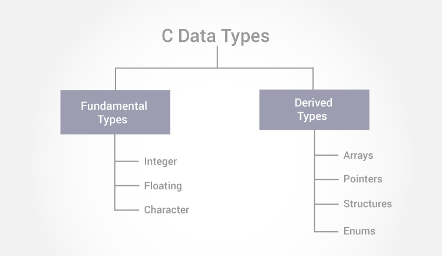

# Data Types
At the most basic level, data types simply allot a certain amount of memory to store something. You might know about certain data types such as `int`, `float`, or `array`. All of these just allot some memory and store something in that memory.

As you can see from the flow chart, there are two main data types in C: Fundamental and Derived Types. We’ll start by talking about the fundamental types.

### Int
Integers are whole numbers that can be either positive or negative, but cannot contain a decimal place. You create an int by declaring a variable `int variableName` They are either 2 or 4 bytes in size (remember 8 bits in a byte). There is also an unsigned int which doesn’t contain a sign bit location and can thus be larger in range, however can only be a positive number.

### Floating Point
Floats are variables that can hold decimal numbers. You create a float by declaring it a `float` or a `double`. Floats take up 4 bytes and doubles take up 8 bytes. There is also a `long double` data type that takes up 10 bytes, but I doubt you’ll ever have numbers that are 1.1E+4932 long...

### Character
The `char` data type is used for declaring character type variables. Each `char` has a size of 1 byte. Chars can be used both as a character as well as a number since characters are encoded as numbers.

