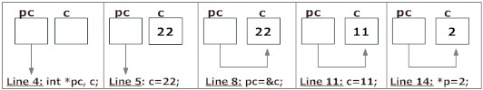

# Pointers
In this lesson, we are going to be learning about pointers. The next two lessons are quite difficult subjects to teach and understand, so be patient with me, and try your best to understand what’s going on. Remember, Google is a great resource for this!

Pointers are a powerful structure that is unique to C (and C++) that Java and Python do not have. Pointers are used to access memory locations and manipulate their addresses. 

### Adresses
Whenever you define a variable, array, or pointer, you are actually just defining a section of memory will be allocated and can’t be used by other things (until it’s freed). To get the address of a variable in memory, you can just tack a `&` in front of it, so `fprintf(stderr, “%d”, %var)` will print the address in memory where my `var` is located. 

### Pointers
Pointers act, like their name says, as a pointer to a location in memory. Instead of storing all the data that is in that location, a pointer just stores an address to the location in memory where everything is. You create a pointer by using the reference operator `&` and you get the data stored in a pointer by using a dereference operator `*`. Here’s an example from *Programiz*:
```C
/* Source code to demonstrate, handling of pointers in C program */
#include <stdio.h>
int main(){
   int* pc;
   int c;
   c=22;
   printf("Address of c:%u\n",&c);
   printf("Value of c:%d\n\n",c);
   pc=&c;
   printf("Address of pointer pc:%u\n",pc);
   printf("Content of pointer pc:%d\n\n",*pc);
   c=11;
   printf("Address of pointer pc:%u\n",pc);
   printf("Content of pointer pc:%d\n\n",*pc);
   *pc=2;
   printf("Address of c:%u\n",&c);
   printf("Value of c:%d\n\n",c);
   return 0;
}
```
And here is what it will output:
```
Address of c: 2686784
Value of c: 22

Address of pointer pc: 2686784
Content of pointer pc: 22

Address of pointer pc: 2686784
Content of pointer pc: 11

Address of c: 2686784
Value of c: 2
```
Here’s a nifty diagram that shows what’s going on:


